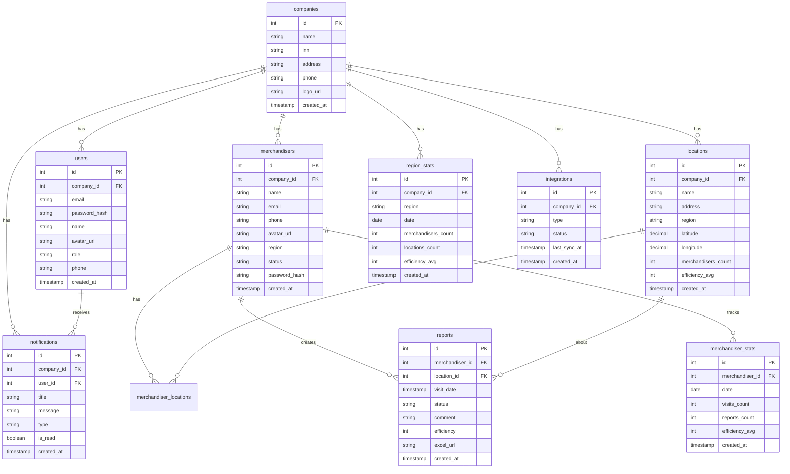

# 🏪 MerchandiseControl - Система управления мерчандайзингом

## 📑 Содержание
1. [Обзор проекта](#обзор-проекта)
2. [Технологический стек](#технологический-стек)
3. [Структура проекта](#структура-проекта)
4. [База данных](#база-данных)
5. [API документация](#api-документация)
6. [Функционал](#функционал)
7. [Безопасность](#безопасность)
8. [Разработка](#разработка)
9. [Тестовые учетные записи](#тестовые-учетные-записи)
10. [Лицензия и поддержка](#лицензия-и-поддержка)

## 📋 Обзор проекта

MerchandiseControl - это веб-система для управления мерчандайзингом, которая позволяет компаниям эффективно контролировать работу мерчандайзеров, отслеживать посещения торговых точек и анализировать эффективность работы.

### ⭐ Основные возможности:
- 👥 Управление мерчандайзерами и их задачами
- 📍 Контроль посещений торговых точек
- 📊 Создание и проверка отчетов
- 📈 Статистика и аналитика эффективности
- 🏪 Управление торговыми точками
- 🔔 Система уведомлений
- 🔒 Разграничение прав доступа

## 🛠️ Технологический стек

### 🎨 Frontend:
- HTML5
- CSS3
- JavaScript (ES6+)
- Bootstrap 5.3.0
- Chart.js (для графиков)
- Leaflet.js (для карт)
- Font Awesome 4.7.0

### ⚙️ Backend:
- PHP 8.0+
- MySQL 8.0

### 🔒 Безопасность:

- Хеширование паролей (Bcrypt)
- CSRF защита
- XSS защита
- Валидация данных 

## 📁 Структура проекта

```
merchandising/
├── api/
│   ├── controllers/
│   │   ├── AuthController.php      # Аутентификация и авторизация
│   │   ├── DashboardController.php # Управление дашбордом
│   │   ├── LocationsController.php # Управление точками продаж
│   │   ├── MerchandisersController.php # Управление мерчандайзерами
│   │   ├── ReportsController.php   # Управление отчетами
│   │   └── StatsController.php     # Статистика и аналитика
│   ├── models/                     # Модели для работы с БД
│   ├── config.php                  # Конфигурация приложения
│   └── index.php                   # Точка входа API
├── css/
│   ├── style.css                   # Общие стили
│   ├── dashboard.css               # Стили дашборда
│   ├── locations.css               # Стили страницы локаций
│   └── reports.css                 # Стили страницы отчетов
├── js/
│   ├── auth.js                     # Аутентификация
│   ├── components.js               # Общие компоненты
│   ├── dashboard.js                # Логика дашборда
│   ├── locations.js                # Управление локациями
│   ├── menu.js                     # Навигационное меню
│   └── reports.js                  # Работа с отчетами
├── images/                         # Изображения и медиафайлы
├── dashboard.html                  # Главная страница дашборда
├── locations.html                  # Страница точек продаж
├── merchandisers.html             # Управление мерчандайзерами
├── reports.html                   # Страница отчетов
├── settings.html                  # Настройки системы
└── index.html                     # Страница входа
```

## 💾 База данных

### 📊 Даталогическая модель


### 📋 Основные таблицы:

1. `companies`
```sql
CREATE TABLE companies (
    id PK
    name VARCHAR(255) NOT NULL
    inn VARCHAR(12) NOT NULL UNIQUE
    address TEXT NOT NULL
    phone VARCHAR(20) NOT NULL
    logo_url TEXT
    created_at TIMESTAMP DEFAULT CURRENT_TIMESTAMP
);
```

2. `users`
```sql
CREATE TABLE users (
    id PK
    company_id FK
    email VARCHAR(255) NOT NULL UNIQUE
    password_hash VARCHAR(255) NOT NULL
    name VARCHAR(255) NOT NULL
    avatar_url TEXT
    role VARCHAR(50) DEFAULT 'admin'
    phone VARCHAR(20)
    created_at TIMESTAMP DEFAULT CURRENT_TIMESTAMP
);
```

3. `merchandisers`
```sql
CREATE TABLE merchandisers (
    id PK
    company_id FK
    name VARCHAR(255) NOT NULL
    email VARCHAR(255) NOT NULL UNIQUE
    password_hash VARCHAR(255) NOT NULL
    phone VARCHAR(20)
    region VARCHAR(100)
    status VARCHAR(50) DEFAULT 'active'
    created_at TIMESTAMP DEFAULT CURRENT_TIMESTAMP
);
```

4. `locations`
```sql
CREATE TABLE locations (
    id PK
    company_id FK
    name VARCHAR(255) NOT NULL
    address TEXT NOT NULL
    region VARCHAR(100)
    coordinates POINT
    status VARCHAR(50) DEFAULT 'active'
    created_at TIMESTAMP DEFAULT CURRENT_TIMESTAMP
);
```

5. `merchandiser_locations`
```sql
CREATE TABLE merchandiser_locations (
    merchandiser_id FK
    location_id FK
    PRIMARY KEY (merchandiser_id, location_id)
);
```

6. `reports`
```sql
CREATE TABLE reports (
    id PK
    merchandiser_id FK
    location_id FK
    visit_date TIMESTAMP NOT NULL
    status VARCHAR(50) DEFAULT 'draft'
    efficiency INTEGER CHECK (efficiency BETWEEN 0 AND 100)
    photos TEXT[]
    notes TEXT
    created_at TIMESTAMP DEFAULT CURRENT_TIMESTAMP
);
```

7. `merchandiser_stats`
```sql
CREATE TABLE merchandiser_stats (
    id PK
    merchandiser_id FK
    date DATE NOT NULL
    visits_count INTEGER DEFAULT 0
    reports_count INTEGER DEFAULT 0
    efficiency_avg DECIMAL(5,2)
    UNIQUE (merchandiser_id, date)
);
```

8. `region_stats`
```sql
CREATE TABLE region_stats (
    id PK
    company_id FK
    region VARCHAR(100)
    date DATE NOT NULL
    merchandisers_count INTEGER DEFAULT 0
    locations_count INTEGER DEFAULT 0
    efficiency_avg DECIMAL(5,2)
    UNIQUE (company_id, region, date)
);
```

## 🔌 API документация

### 🔑 Аутентификация

1. Вход в систему
```http
POST /api/auth/login
Content-Type: application/json

{
    "email": "user@example.com",
    "password": "password"
}

Response:
{
    "success": true,
    "token": "jwt_token",
    "user": {
        "id": 1,
        "name": "User Name",
        "role": "admin",
        "company_id": 1
    }
}
```

2. Обновление токена
```http
POST /api/auth/refresh
Authorization: Bearer refresh_token

Response:
{
    "success": true,
    "token": "new_jwt_token"
}
```

### 👥 Мерчандайзеры

1. Получение списка
```http
GET /api/merchandisers
Authorization: Bearer token
Query params: 
- status (active/inactive/pending)
- region (string)
- search (string)

Response:
{
    "success": true,
    "merchandisers": [
        {
            "id": 2,
            "name": "Иванов Николай Петрович",
            "email": "ivanov@mail.ru",
            "phone": "+7 (928) 474-77-41",
            "region": "Moscow",
            "status": "active",
            "avatar_url": "uploads/avatars/avatar_2_1741623238.png"
        }
    ]
}
```

2. Добавление мерчандайзера
```http
POST /api/merchandisers
Authorization: Bearer token
Content-Type: application/json

{
    "name": "Елисеев Геннадий Викторович",
    "email": "eliseev@yandex.ru",
    "phone": "+7(988)746-38-23",
    "region": "Казань",
    "password": "password"
}

Response:
{
    "success": true,
    "merchandiser": {
        "id": 5,
        "name": "Елисеев Геннадий Викторович",
        "email": "eliseev@yandex.ru"
    }
}
```

### 📍 Локации

1. Получение списка
```http
GET /api/locations
Query params:
- region (string)
- status (active/inactive)
- merchandiser_id (int)

Response:
{
    "success": true,
    "locations": [
        {
            "id": 4,
            "name": "Цветочный магазин",
            "address": "Большой Ордынский переулок, 4с3",
            "region": "Москва",
            "coordinates": [55.734783, 37.625737],
            "merchandisers_count": 0,
            "efficiency_avg": 0
        }
    ]
}
```

2. Добавление точки
```http
POST /api/locations
{
    "name": "Кофейня на Островского",
    "address": "улица Кави Наджми, 3/9",
    "region": "Казань",
    "coordinates": "55.790182,49.112606",
    "merchandisers": [5]
}

Response:
{
    "success": true,
    "location": {
        "id": 6,
        "name": "Кофейня на Островского"
    }
}
```

### 📝 Отчеты

1. Создание отчета
```http
POST /api/reports
Authorization: Bearer token
Content-Type: application/json

{
    "location_id": 4,
    "visit_date": "2025-03-10",
    "comment": "Оставил отчет",
    "excel_url": "67cf44a288b66_BUL_MO_2024.xlsx"
}

Response:
{
    "success": true,
    "report": {
        "id": 2,
        "status": "rejected",
        "merchandiser_id": 2,
        "location_id": 4,
        "visit_date": "2025-03-10",
        "comment": "Оставил отчет",
        "excel_url": "67cf44a288b66_BUL_MO_2024.xlsx"
    }
}
```

2. Получение статистики
```http
GET /api/stats/dashboard
Authorization: Bearer token
Query params:
- period (week/month/year)
- region (string)

Response:
{
    "success": true,
    "metrics": {
        "active_merchandisers": 5,
        "visits_today": 2,
        "reports_approved": 1,
        "reports_rejected": 1
    },
    "stats": [
        {
            "merchandiser_id": 2,
            "date": "2025-03-10",
            "visits_count": 2,
            "reports_count": 1
        }
    ],
    "regions": [
        {
            "company_id": 1,
            "region": "Москва",
            "date": "2025-03-10",
            "merchandisers_count": 1,
            "locations_count": 1
        }
    ]
}
``` 

## ⚡ Функционал

### 📊 Дашборд
- Отображение ключевых метрик компании
- График активности мерчандайзеров
- График эффективности по регионам
- Фильтрация по периодам (неделя/месяц/год)
- Интерактивные графики с всплывающими подсказками

### 👥 Управление мерчандайзерами
- Добавление/редактирование/удаление мерчандайзеров
- Назначение регионов работы
- Управление статусами активности
- Просмотр индивидуальной статистики
- Привязка к торговым точкам

### 📍 Управление локациями
- Добавление/редактирование/удаление точек
- Отображение на интерактивной карте
- Привязка к регионам
- Назначение мерчандайзеров
- Просмотр истории посещений

### 📝 Отчеты
- Создание отчетов о посещениях
- Загрузка фотографий с точки
- Оценка эффективности работы
- Статусы проверки отчетов
- Комментарии и заметки

### 📈 Статистика
- Автоматический расчет KPI
- Генерация отчетов по периодам
- Визуализация данных через графики
- Экспорт статистики в Excel

## 🔒 Безопасность

### 🔑 Аутентификация
- Хеширование паролей через Bcrypt
- Защита от брутфорса через ограничение попыток
- Автоматический выход при неактивности

### 👮 Авторизация
- Разделение прав доступа (админ/мерчандайзер)
- Проверка принадлежности к компании
- Валидация всех действий
- Логирование важных операций

### 🛡️ Защита данных
- Prepared statements для SQL
- Валидация всех входных данных

## 🔧 Разработка

### 📋 Требования к окружению
- PHP 8.0+
- MySQL 8.0+

## 📄 Лицензия и поддержка

MIT License. См. файл LICENSE для деталей.

## 🔑 Тестовые учетные записи

### 👨‍💼 Администраторы
| Email | Пароль |
|-------|---------|
| riga@fpi.ru | 12345678 |

### 👥 Менеджеры
| Email | Пароль |
|-------|---------|
| ivanov@mail.ru | 12345678 |
| petrova@ya.ru | 12345678 |
| eliseev@yandex.ru | 12345678 |

## 💬 Поддержка

По вопросам поддержки обращайтесь:
- 📱 Telegram: @svlkff 
